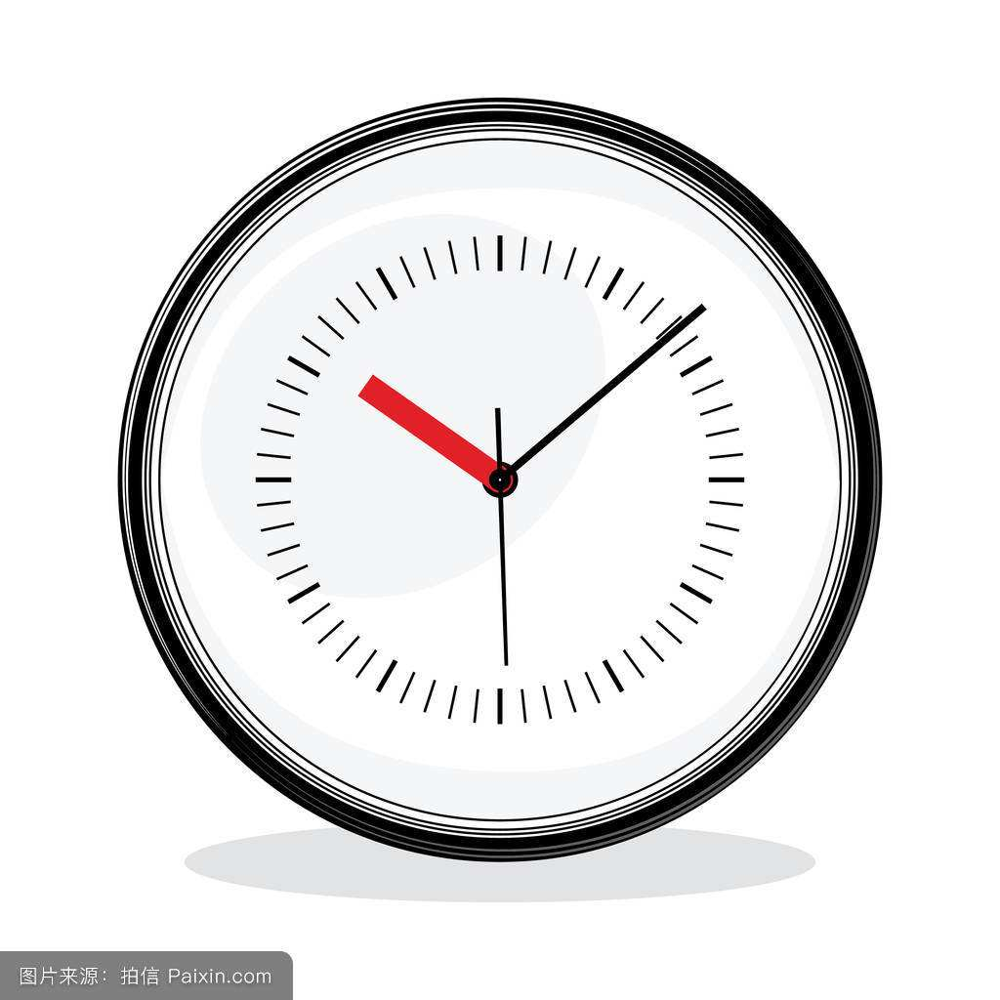
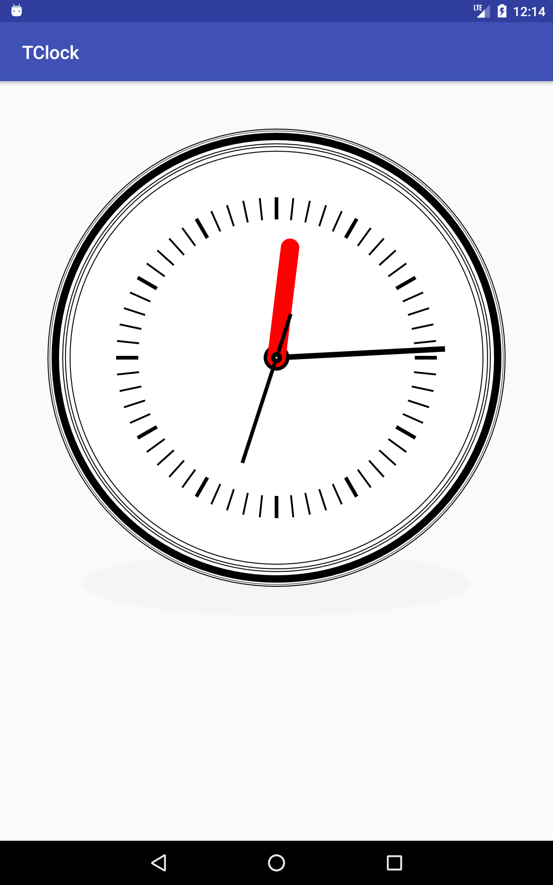
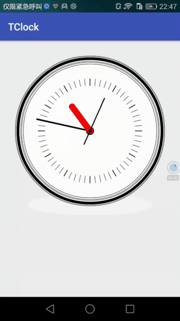

# TClock
[一个简单的时钟表盘控件](https://github.com/tantian/TClock)
## 为什么写这个项目
这两天看了一下Android中的属性动画，想自己动手写点东西，本来以为时钟可以直接使用动画来实现，所以随便找了一张表盘的图，然后自己动手画出了这个表盘。

原型图 

实现效果 

动图效果

## 学到了什么
从头实现了一遍这个，对Paint和Canvas有了更加熟练的使用，中间遇到的困难也不少，主要是表盘刻度和指针的位置问题，多试几遍后就可以解决。

